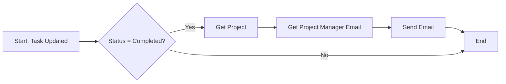

# Week 1, Day 5-6: Flow Builder Automation

## 📚 Learning Objectives

Sau khi hoàn thành các bài học này, bạn sẽ:
- ✅ Hiểu Flow Builder interface
- ✅ Tạo Record-Triggered Flows
- ✅ Sử dụng Flow elements (Get Records, Create Records, Update Records, Send Email)
- ✅ Debug và test flows
- ✅ Implement business automation

---

## 🎯 Part 1: Flow Builder Overview

### What is Flow?

Flow là công nghệ automation của Salesforce cho phép:
- **No-code automation** - Không cần code
- **Complex business logic** - Xử lý logic phức tạp
- **User-facing or backend** - Screen flows hoặc record-triggered flows
- **Reusable components** - Subflows, actions

### Flow Types

| Type | Description | Use Case |
|-------|-------------|-----------|
| **Screen Flow** | User interaction required | Forms, wizards, guided processes |
| **Record-Triggered Flow** | Automatic when record changes | Field updates, related records creation |
| **Schedule-Triggered Flow** | Runs on schedule | Batch updates, periodic tasks |
| **Platform Event-Triggered Flow** | Responds to events | Integration scenarios |

### Flow Elements

| Element | Description | Example |
|----------|-------------|----------|
| **Start** | Trigger point | When record is created/updated |
| **Get Records** | Query data | Get Project details |
| **Create Records** | Insert new record | Create Task when Project created |
| **Update Records** | Modify existing record | Update Project status when all Tasks completed |
| **Decision** | Branch logic | Check if Status = Completed |
| **Loop** | Iterate through collection | Process all Tasks in a Project |
| **Send Email** | Email alert | Notify manager when Task completed |
| **Assignment** | Set variable values | Calculate budget variance |

---

## 🏗️ Part 2: Task Completion Email Flow

### Flow Overview

**Goal:** Send email to Project Manager when Task status changes to "Completed"

**Type:** Record-Triggered Flow
**Object:** Task__c
**Trigger:** A record is updated
**Entry Criteria:** Status = Completed

### Step-by-Step Implementation

#### Step 1: Create Flow

**Path:** Setup → Flows → New Flow

**Flow Settings:**
```
Flow Label: Task Completion Email
Flow API Name: Task_Completion_Email
Flow Type: Record-Triggered Flow
Object: Task__c
Trigger: A record is updated
Entry Criteria: Status = Completed
Optimize for: Fast Field Updates (Before Save)
```

#### Step 2: Get Project Manager

**Add Element:** Get Records

**Settings:**
```
Label: Get Project Manager
API Name: Get_Project_Manager
Object: Project__c
Condition:
  - Field: Id
  - Operator: Equals
  - Value: {!$Record.Project__c}
  
All Records: No (only first)
Sort Order: None
```

#### Step 3: Get Project Manager Email

**Add Element:** Get Records

**Settings:**
```
Label: Get Project Manager Email
API Name: Get_Project_Manager_Email
Object: User
Condition:
  - Field: Id
  - Operator: Equals
  - Value: {!Get_Project_Manager.OwnerId}
  
All Records: No (only first)
Sort Order: None
```

#### Step 4: Send Email to Project Manager

**Add Element:** Send Email

**Settings:**
```
Label: Send Completion Email
API Name: Send_Completion_Email

Email Body:
  Hello {!Get_Project_Manager_Email.Name},

  Task {!$Record.Name} has been completed!

  Task Details:
  - Task: {!$Record.Name}
  - Description: {!$Record.Description__c}
  - Due Date: {!$Record.Due_Date__c}
  - Actual Hours: {!$Record.Hours_Actual__c}

  Project: {!Get_Project_Manager.Name}
  Priority: {!$Record.Priority__c}

  Please review and provide feedback.

  Best regards,
  Salesforce Automation

Subject: Task Completed - {!$Record.Name}

To Address: {!Get_Project_Manager_Email.Email}
```

#### Step 5: Update Project Completion Status

**Add Element:** Update Records

**Settings:**
```
Label: Update Project Status
API Name: Update_Project_Status

Object: Project__c
Filter Condition:
  - Field: Id
  - Operator: Equals
  - Value: {!$Record.Project__c}

Set Field Values:
  - Field: Completed_Tasks__c (Roll-up summary)
    (This auto-updates, but shown for clarity)
```

### Complete Flow Diagram



---

## 🔄 Part 3: Advanced Flow - Project Auto-Update

### Flow Overview

**Goal:** Automatically update Project status when all Tasks are completed

**Type:** Record-Triggered Flow
**Object:** Task__c
**Trigger:** A record is updated
**Entry Criteria:** Status = Completed

### Implementation

#### Step 1: Get All Tasks for Project

**Add Element:** Get Records

**Settings:**
```
Label: Get All Project Tasks
API Name: Get_All_Project_Tasks
Object: Task__c
Condition:
  - Field: Project__c
  - Operator: Equals
  - Value: {!$Record.Project__c}

All Records: Yes
Sort Order:
  - Field: Due_Date__c
  - Direction: Ascending
```

#### Step 2: Count Incomplete Tasks

**Add Element:** Assignment

**Settings:**
```
Label: Count Incomplete Tasks
API Name: Count_Incomplete_Tasks

Assignments:
  - Variable: {!var_IncompleteCount}
    Operator: Add
    Value: 1
  
  (Use Loop element in practice for accurate count)
```

#### Step 3: Decision - All Tasks Completed?

**Add Element:** Decision

**Settings:**
```
Label: All Tasks Completed?
API Name: All_Tasks_Completed

Outcome Requirements:
  - All Tasks Completed: {!var_IncompleteCount} = 0
```

#### Step 4: Update Project Status

**Add Element:** Update Records

**Settings:**
```
Label: Mark Project Completed
API Name: Mark_Project_Completed

Object: Project__c
Filter Condition:
  - Field: Id
  - Operator: Equals
  - Value: {!$Record.Project__c}

Set Field Values:
  - Field: Status__c
    Value: Completed
  
  - Field: End_Date__c
    Value: {!$Today}
```

---

## 🧪 Part 4: Debugging and Testing

### Debug Mode

**Path:** Flow Builder → Debug

**Debug Features:**
- ✅ Step-by-step execution
- ✅ Variable inspection
- ✅ Error identification
- ✅ Real-time data preview

### Test Scenarios

**Scenario 1: Task Completion Email**
1. Create a Task record with Status = "Not Started"
2. Update Task to Status = "Completed"
3. Check: Email sent to Project Manager
4. Check: Email content is correct
5. Verify: Project Manager receives email

**Scenario 2: Project Auto-Update**
1. Create a Project with multiple Tasks
2. Complete all Tasks except one
3. Check: Project status remains unchanged
4. Complete final Task
5. Verify: Project status updates to "Completed"

### Common Flow Issues & Solutions

| Issue | Cause | Solution |
|--------|--------|----------|
| Flow not triggering | Entry criteria not met | Verify field values match criteria |
| Email not sending | No email address | Check recipient field is populated |
| Update not happening | Record filter incorrect | Verify filter conditions match record |
| Loop not working | Collection empty | Check Get Records element |
| Timeout | Too many records | Optimize query or use Batch Apex |

---

## 💡 Part 5: Best Practices

### Flow Design
- ✅ **Keep flows simple** - Break complex logic into multiple flows
- ✅ **Use subflows** - Reuse common logic
- ✅ **Document flows** - Add descriptions for each element
- ✅ **Error handling** - Use Fault paths for errors
- ✅ **Test thoroughly** - Use Debug mode before activating

### Performance
- ✅ **Optimize Get Records** - Use specific filters
- ✅ **Limit fields** - Only select needed fields
- ✅ **Use Formula** - Calculate values when possible
- ✅ **Avoid loops** - Use Roll-up summary fields instead
- ✅ **Optimize for Fast Field Updates** - Use Before Save when possible

### Security
- ✅ **Field-level security** - Flows respect FLS
- ✅ **Sharing rules** - Flows respect sharing
- ✅ **User context** - Flows run in user context by default
- ✅ **System mode** - Use only when necessary

---

## 📝 Practice Exercise

**Scenario:** Create a flow to assign Tasks automatically.

**Requirements:**
1. When Task created with no Assigned To
2. Find Project Manager from related Project
3. Assign Task to Project Manager
4. Send confirmation email to assignee

**Time Estimate:** 45 minutes

**Hint:** Use Get Records element twice (get Project, then get Owner)

---

## ✅ Checklist

### Day 5: Basic Flow
- [ ] Create Task Completion Email flow
- [ ] Configure Get Records elements
- [ ] Set up email template
- [ ] Test flow in Debug mode
- [ ] Activate flow
- [ ] Test in production

### Day 6: Advanced Flow
- [ ] Create Project Auto-Update flow
- [ ] Implement decision logic
- [ ] Add update record element
- [ ] Test with multiple scenarios
- [ ] Debug and fix issues
- [ ] Document flow behavior

---

## 🔧 Flow Elements Reference

### Core Elements

| Element | Description | Use When |
|----------|-------------|-----------|
| **Start** | Entry point | Beginning of every flow |
| **End** | Exit point | Normal or fault exit |
| **Assignment** | Set variable values | Calculations, string operations |
| **Decision** | Conditional logic | Branching based on conditions |
| **Loop** | Iterate collection | Process multiple records |

### Data Elements

| Element | Description | Use When |
|----------|-------------|-----------|
| **Get Records** | Query records | Retrieve data from objects |
| **Create Records** | Insert new records | Create new records |
| **Update Records** | Modify records | Update existing records |
| **Delete Records** | Remove records | Delete records |

### Action Elements

| Element | Description | Use When |
|----------|-------------|-----------|
| **Send Email** | Email alert | Notify users |
| **Post to Chatter** | Chatter post | Collaborative updates |
| **Quick Action** | Call action | Execute actions |
| **Apex** | Call Apex class | Complex logic |

---

## 🎓 Trailhead Modules

Complete these modules for deeper understanding:
- [ ] **Flow Builder Fundamentals** - https://trailhead.salesforce.com/content/learn/modules/flow_builder_fundamentals
- [ ] **Flow Logic** - https://trailhead.salesforce.com/content/learn/modules/flow_logic
- [ ] **Flow Actions** - https://trailhead.salesforce.com/content/learn/modules/flow_actions

---

## 📚 Next Steps

Sau khi hoàn thành Days 5-6:
1. ✅ Verify all flows work correctly
2. ✅ Test with real data
3. ✅ Document flow behavior
4. ✅ Prepare for Day 7: Review & Practice

---

**Tiếp tục:** [Day 7: Review & Practice](./review.md)