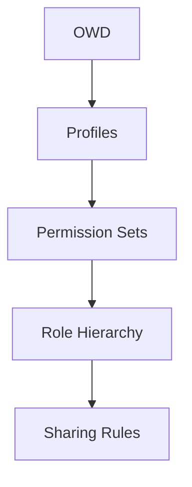

# Week 1, Day 3-4: Security Model

## 📚 Learning Objectives

Sau khi hoàn thành các bài học này, bạn sẽ:
- ✅ Hiểu Organization-Wide Defaults (OWD)
- ✅ Tạo và configure Profiles
- ✅ Tạo Permission Sets
- ✅ Thiết lập Role Hierarchy
- ✅ Configure Sharing Rules
- ✅ Understand Field Level Security (FLS)

---

## 🎯 Part 1: Organization-Wide Defaults (OWD)

### What is OWD?

OWD sets the baseline access level for all users in the org. It's the most restrictive level that can be set.

### Access Levels

| Level | Description | When to Use |
|-------|-------------|--------------|
| **Private** | Only record owner + above in role hierarchy can see | Financial data, sensitive info |
| **Public Read Only** | All can view, only owner can edit | Reference data, public info |
| **Public Read/Write** | All can view and edit | Collaborative data, shared info |
| **Public Read/Write/Transfer** | All can view, edit, and transfer ownership | Sales opportunities |

### OWD for Project Management App

**Project Object:** Public Read/Write
- Reason: Team collaboration needed

**Task Object:** Controlled by Parent (Master-Detail)
- Inherits from Project's OWD

**Path:** Setup → Object Manager → Project__c → Sharing Settings



---

## 🔐 Part 2: Profiles

### What is a Profile?

A profile is a collection of settings and permissions that determine:
- Which objects users can access
- What they can do with those objects (CRUD)
- Which fields they can see (FLS)
- Which apps and tabs they can see
- Page layouts they see

### Create Project Manager Profile

**Path:** Setup → Profiles → New Profile

**Profile Settings:**
```
Profile Name: Project Manager
User License: Salesforce
Profile Clone From: Standard User
```

**Object Permissions:**

| Object | Read | Create | Edit | Delete | View All | Modify All |
|---------|-------|--------|-------|---------|----------|------------|
| Account | ✓ | ✗ | ✗ | ✗ | ✗ |
| Contact | ✓ | ✗ | ✗ | ✗ | ✗ |
| Opportunity | ✗ | ✗ | ✗ | ✗ | ✗ |
| Project__c | ✓ | ✓ | ✓ | ✓ | ✓ |
| Task__c | ✓ | ✓ | ✓ | ✓ | ✓ |

**Field Level Security (Project__c):**

| Field | Visible | Read-Only |
|-------|---------|-----------|
| Name | ✓ | ✗ |
| Description | ✓ | ✗ |
| Status | ✓ | ✗ |
| Priority | ✓ | ✗ |
| Start_Date__c | ✓ | ✗ |
| End_Date__c | ✓ | ✗ |
| Budget__c | ✓ | ✓ | (Read-only for team members) |
| Actual_Cost__c | ✓ | ✓ | (Read-only for team members) |

**App & Tab Settings:**
- App: Project Manager (Default On)
- Tabs: Projects, Tasks, Home, Reports (Default On)
- All other tabs: Tab Hidden

---

## 🎫 Part 3: Permission Sets

### What is a Permission Set?

A permission set grants additional access to users without changing their profile. Used for:
- Granting access to specific features
- Temporary permissions
- Fine-grained access control

### Create Project Admin Permission Set

**Path:** Setup → Permission Sets → New Permission Set

**Permission Set Settings:**
```
Label: Project Admin
API Name: Project_Admin
Description: Full admin access to Project Management App
License: None
```

**Object Permissions:**

| Object | Read | Create | Edit | Delete | View All | Modify All |
|---------|-------|--------|-------|---------|----------|------------|
| Project__c | ✓ | ✓ | ✓ | ✓ | ✓ |
| Task__c | ✓ | ✓ | ✓ | ✓ | ✓ |

**Field Level Security:**
- Full access to all fields on Project__c and Task__c
- No read-only restrictions

**System Permissions:**
- ✅ Modify All Data
- ✅ View All Data
- ✅ Customize Application
- ✅ Manage Dashboards

### Assign Permission Set to Users

**Path:** Permission Set → Manage Assignments → Add Assignments

Select users who need admin access to projects.

---

## 📊 Part 4: Role Hierarchy

### What is Role Hierarchy?

Role hierarchy determines record access based on organizational structure. Users higher in the hierarchy inherit access to all records owned by users below them.

### Create Roles

**Path:** Setup → Roles → Set Up Roles

**Role Structure:**

```
CEO
├── VP of Projects
│   ├── Project Manager A
│   └── Project Manager B
└── VP of Engineering
    ├── Team Lead 1
    └── Team Lead 2
```

**Role Settings:**

| Role | Description | Users |
|------|-------------|---------|
| CEO | Chief Executive | CEO user |
| VP of Projects | Head of Projects | VP user |
| Project Manager A | Manages Project Team A | PM A user |
| Project Manager B | Manages Project Team B | PM B user |

### Role Hierarchy Access

- CEO sees ALL records (everything below)
- VP of Projects sees records of Project Manager A & B
- Project Manager A sees records of their team members only

---

## 🤝 Part 5: Sharing Rules

### What are Sharing Rules?

Sharing rules open up access beyond OWD and role hierarchy. They're used for:
- Sharing with specific groups
- Record-based sharing
- Temporary access

### Create Project Sharing Rule

**Path:** Setup → Sharing Settings → Project__c → Add Sharing Rule

**Sharing Rule Settings:**
```
Rule Name: Share Projects with Engineering
Label: Share Projects with Engineering
Based on: Record Owner's Role

From: Project Manager A
Share With: VP of Engineering
Access Level: Read/Write
```

**Another Example:**
```
Rule Name: Share Completed Projects
Label: Share Completed Projects
Based on: Criteria

From: Status = Completed
Share With: Internal Users
Access Level: Read Only
```

---

## 🔒 Part 6: Field Level Security (FLS)

### What is FLS?

FLS controls which fields users can see and edit, regardless of object access.

### FLS Matrix

| Profile | Budget | Actual Cost | Status | Priority |
|---------|---------|-------------|---------|-----------|
| Project Manager | Read/Write | Read/Write | Read/Write | Read/Write |
| Team Member | Read Only | Read Only | Read/Write | Read/Write |
| Guest User | Hidden | Hidden | Hidden | Hidden |

### Configure FLS

**Path:** Setup → Object Manager → Project__c → Set Field-Level Security

**Best Practices:**
1. **Default to Hidden** for sensitive fields
2. **Use Read-Only** for calculated fields
3. **Grant access progressively** using Permission Sets
4. **Document FLS decisions** for audit

---

## 🏗️ Security Model for Project Management App

### Summary

```
┌─────────────────────────────────────┐
│     Organization-Wide Defaults      │
│  Project: Public Read/Write        │
│  Task: Controlled by Parent       │
└─────────────┬───────────────────┘
              │
              ▼
┌─────────────────────────────────────┐
│         Profiles                  │
│  - Project Manager (basic access) │
│  - Team Member (limited access)   │
└─────────────┬───────────────────┘
              │
              ▼
┌─────────────────────────────────────┐
│      Permission Sets             │
│  - Project Admin (full access)   │
└─────────────┬───────────────────┘
              │
              ▼
┌─────────────────────────────────────┐
│       Role Hierarchy             │
│  CEO → VP → Manager → Team     │
└─────────────┬───────────────────┘
              │
              ▼
┌─────────────────────────────────────┐
│       Sharing Rules              │
│  - Open access as needed        │
└─────────────┬───────────────────┘
              │
              ▼
┌─────────────────────────────────────┐
│    Field Level Security         │
│  - Control field visibility    │
└─────────────────────────────────────┘
```

---

## 🧪 Testing Security

### Test Scenarios

**Scenario 1: Test Profile Access**
1. Create test user with "Project Manager" profile
2. Log in as test user
3. Verify: Can create Project and Task records
4. Verify: Cannot delete Account records
5. Verify: Can see Budget field (read-only)

**Scenario 2: Test Role Hierarchy**
1. Create two users in different roles
2. User A creates a Project
3. User B (higher in hierarchy) should see User A's records
4. User C (different branch) should NOT see User A's records

**Scenario 3: Test Sharing Rules**
1. Create sharing rule between roles
2. Verify records are shared correctly
3. Test access levels (Read Only vs Read/Write)

---

## 📝 Practice Exercise

**Scenario:** Implement security for Client object.

**Requirements:**
1. OWD: Private
2. Create "Client Manager" profile
3. Create "View All Clients" permission set
4. Set up role hierarchy for Client Manager
5. Create sharing rule for completed projects

**Time Estimate:** 45 minutes

---

## ✅ Checklist

### Day 3: Profiles & Permission Sets
- [ ] Create Project Manager profile
- [ ] Configure object permissions
- [ ] Set up field-level security
- [ ] Create Project Admin permission set
- [ ] Assign permission set to users
- [ ] Test profile access

### Day 4: Roles & Sharing
- [ ] Create role hierarchy
- [ ] Assign users to roles
- [ ] Configure OWD for Project and Task
- [ ] Create sharing rules
- [ ] Test role-based access
- [ ] Test sharing rules

---

## 🔧 Best Practices

### Security Design
- ✅ Apply principle of least privilege
- ✅ Use OWD as baseline, open up with sharing rules
- ✅ Document all security decisions
- ✅ Regularly audit access

### Implementation
- ✅ Use permission sets for flexibility
- ✅ Plan role hierarchy before implementation
- ✅ Test security thoroughly
- ✅ Educate users on security model

### Common Mistakes to Avoid
- ❌ Giving too much access in profiles
- ❌ Overlooking field-level security
- ❌ Not testing with different users
- ❌ Forgetting about sharing rules

---

## 🎓 Trailhead Modules

Complete these modules for deeper understanding:
- [ ] **Data Security** - https://trailhead.salesforce.com/content/learn/modules/data_security
- [ ] **Object-Level Security** - https://trailhead.salesforce.com/content/learn/modules/object_level_security
- [ ] **Field-Level Security** - https://trailhead.salesforce.com/content/learn/modules/field_level_security

---

## 📚 Next Steps

Sau khi hoàn thành Days 3-4:
1. ✅ Verify security model works as designed
2. ✅ Test with different user profiles
3. ✅ Document security decisions
4. ✅ Prepare for Day 5-6: Flow Builder

---

**Tiếp tục:** [Day 5-6: Flow Builder](./flow.md)